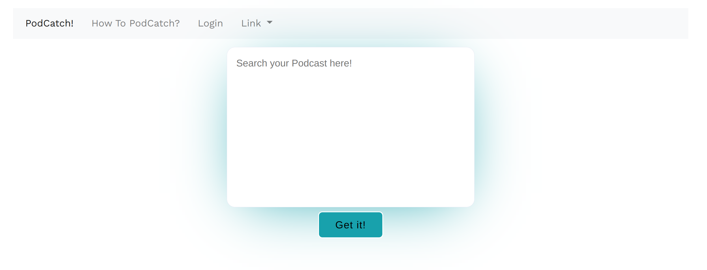
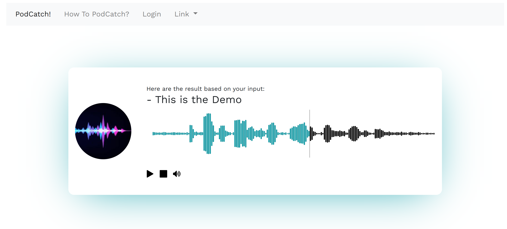

## PodCatch! Mockup Preview
This is an python supported web application using the Flask backend. 
Then simply run the app.py to render the server. 
``` Linux
python app.py 
```
Running following command to install all the dependency packages
``` Linux
pip install -r requirements.txt
```

| variable  |   type |             default             |                                      description | generated method |
|:----------|-------:|:-------------------------------:|-------------------------------------------------:|:-----------------|
| sentence  | string |              none               |                       The user text query input. | automatic        |
| fileName  | string | ./static/data/sample-000000.mp3 |               The file name that chosen to play. | python backend   |
| startTime |  float |              none               | The starting time for the chosen file to render. | python backend      |
| endTime   |  float |              none               |   The ending time for the chosen file to render. | python backend      |


### Main Search Window
<div align="center">
  
</div>

### Result Window
<div align="center">
  
</div>
