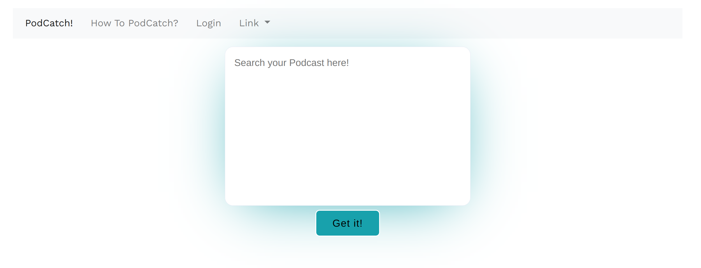
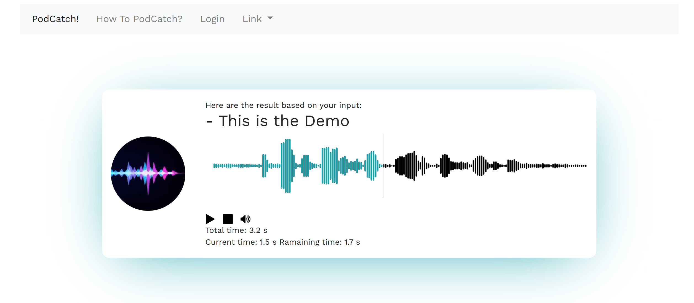

# pod-search

<!--
*** Thanks for checking out the Best-README-Template. If you have a suggestion
*** that would make this better, please fork the repo and create a pull request
*** or simply open an issue with the tag "enhancement".
*** Don't forget to give the project a star!
*** Thanks again! Now go create something AMAZING! :D
-->


<!-- PROJECT LOGO -->
<br />
<div align="center">

  <h1 align="center">pod-search</h3>

  <p align="center">
    An AI-powered search engine for content in podcasts.
    <br />
    <!-- <a href="https://github.com/othneildrew/Best-README-Template"><strong>Explore the docs »</strong></a>
    <br />
    <br />
    <a href="https://github.com/othneildrew/Best-README-Template">View Demo</a>
    ·
    <a href="https://github.com/othneildrew/Best-README-Template/issues">Report Bug</a>
    ·
    <a href="https://github.com/othneildrew/Best-README-Template/issues">Request Feature</a> -->
  </p>
</div>


## About the Project

During the [Sound of AI Hackathon](https://musikalkemist.github.io/thesoundofaihackathon/) we set out to build an AI-powered search engine for content in podcasts. This is the working prototype and demo.

## Demo

### Main Search Window
<div align="center">
  
</div>

### Result Window
<div align="center">
  
</div>


## Getting Started

### Installation

1. create a virtual Python environment and install requirements from `requirements.txt`

### Setup

1. TODO: download example podcasts
2. TODO: 
3. run the data worker
```shell
python engine/worker.py
```

### Usage

1. start the web app 
```shell
python app/app.py
```
2. navigate to the web app in your browser, enter a search query and check out the results

## Contributing

Contributions are what make the open source community such an amazing place to learn, inspire, and create. Any contributions you make are **greatly appreciated**.

If you have a suggestion that would make this better, please fork the repo and create a pull request. You can also simply open an issue with the tag "enhancement".

1. Fork the Project
2. Create your Feature Branch (`git checkout -b feature/AmazingFeature`)
3. Commit your Changes (`git commit -m 'Add some AmazingFeature'`)
4. Push to the Branch (`git push origin feature/AmazingFeature`)
5. Open a Pull Request

<p align="right">(<a href="#top">back to top</a>)</p>


